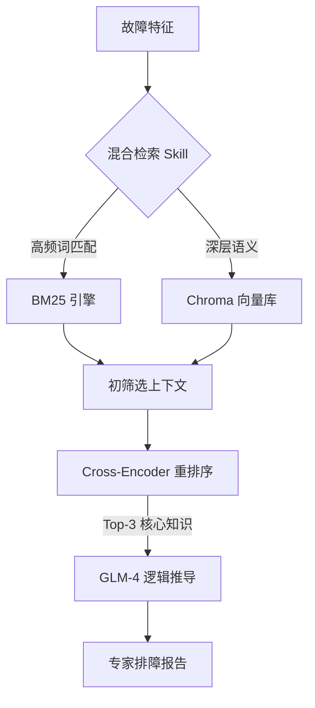

# 故障专家.skill

> “从此以后，生产环境不止有告警，还有一个懂一切的它。”

 
 
 
 

---

服务崩了，但排障文档还在？
三年的积累，变成 Wiki 里一个不敢点开的搜索框？
你还记得去年双十一那个类似的问题其实是可以通过一行指令定位的吗？

**将测试和运维经验凝炼成 Skill，不是为了记录，是为了不再重复。**

提供故障现象、系统日志、监控截图，加上你的初步判断
生成一个**专家级**的 AI 诊断报告
用它的逻辑告诉你什么时间该重启、什么时间该扩容、什么时间该修复索引。

[数据来源](#) · [安装说明](#) · [使用示例](#) · [效果展示](#) · [English](#)

---

## 🏗️ 技能架构

## 🌟 为什么这个 Skill 不同寻常？

### 1. 它是具备“嗅觉”的 (Hybrid Search)
与普通的 RAG 不同，这个 Skill 对技术细节具备病态的敏感。无论是 `5432` 端口还是反人类的 `ORA-600` 错误码，它都能像猎犬一样从万级文档中瞬间锁定真相。

### 2. 它是具备“记忆”的 (Stateful RCA)
排障不是一锤子买卖。它支持 Session 状态追踪，AI 会根据你的反馈不断迭代结论。它不再是只会点头的助手，而是会主动向你索要证据的“高级工程师”。

### 3. 它是具备“审美”的 (Structured Push)
每一份输出不仅是文字，更是符合运维标准的诊断书。它懂得什么时候该通过钉钉给你推送告警，什么时候该安静地待在后台。

## 📂 快速加载

1. **载入依赖**: `pip install -r requirements.txt`
2. **注入灵魂**: 将 Markdown 排障文档放入 `data/knowledge_base/`
3. **唤醒 Skill**: `python scripts/server.py`
4. **效果验证**: `python scripts/test_expert.py`

---
> “运维和测试不只是冷冰冰的指令，还有数字世界的秩序与守护。”
